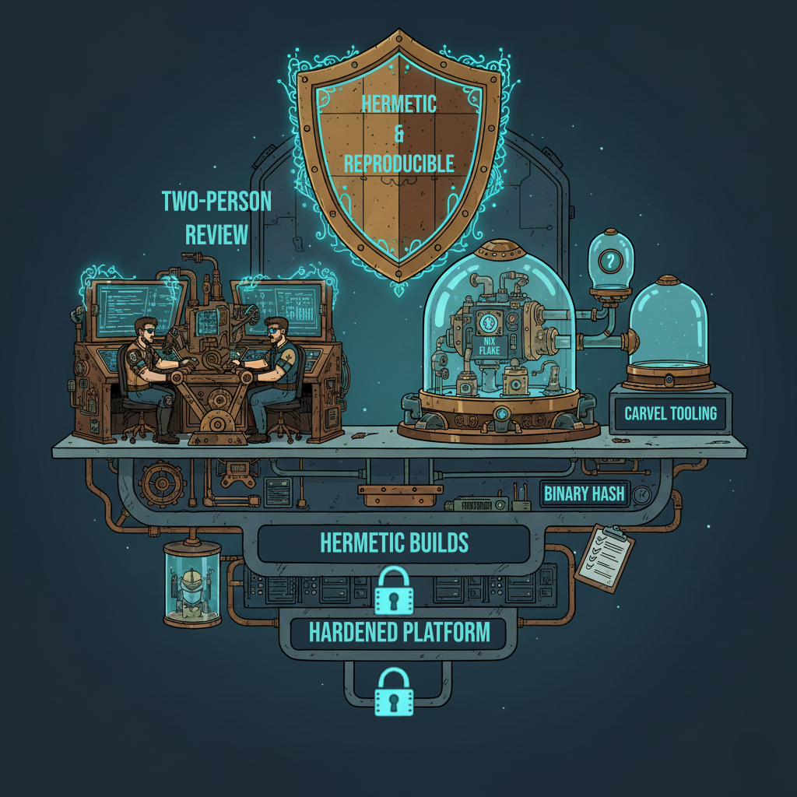
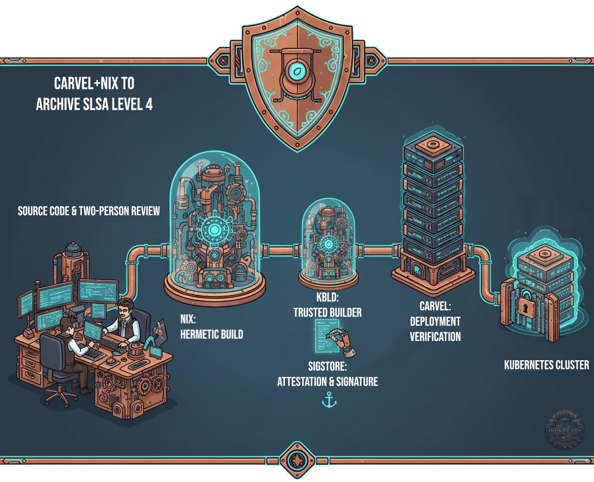

In the discipline of systems engineering, visibility is the prerequisite for security. To manage risk, one must first eliminate obscurity. Within Cloud-Native infrastructure, however, a persistent "fog of uncertainty" often plagues the build pipeline. While most organizations maintain clear records of their source code and its eventual deployment target, a critical gap remains: the ability to prove, with cryptographic certainty, that the binary active in a production container is bit-for-bit identical to the verified source code.

For the vast majority of modern enterprises, this level of technical provenance is currently unattainable. This systemic vulnerability is precisely why the SLSA (Supply-chain Levels for Software Artifacts) framework has become essential. Achieving SLSA Level 4 represents the definitive standard for securing digital infrastructure, moving beyond mere "best practices" toward a state of verifiable, end-to-end integrity.

--------------------------------------------------------------------------------

## What is SLSA? (The Rules of Engagement)
SLSA (pronounced "salsa") is a security framework, a checklist of standards and controls to prevent tampering, improve integrity, and secure packages and infrastructure. It creates a verifiable chain of trust from the developer's keyboard to the production cluster.
Think of it as the "food safety rating" for your software ingredients.
The framework is divided into levels of increasing difficulty and security:
• Level 1: You are documenting your build process. (Provenance exists).
• Level 2: Your build service is authenticated, and provenance is signed.
• Level 3: The build platform is hardened, preventing runs from overlapping or influencing each other.
The Gold Standard: SLSA Level 4
Level 4 is the "Systemic Mastery" of software engineering. To achieve this, you need:
1. Two-Person Review: No single developer can push code that ends up in an artifact without oversight.
2. Hermetic Builds: The build process must run in an isolated environment with no network access (after fetching dependencies). It cannot access "random" files from the internet or the host machine.
3. Reproducibility: If I run the build today, and you run the build next year on a different machine, we must get the exact same binary hash.

--------------------------------------------------------------------------------
## The Cost of Failure: Why "Trust Me, Bro" No Longer Works
Why do we need this rigor? Because the "fog of war" in the supply chain is where attackers are currently hiding.
The SolarWinds Compromise
In one of the most sophisticated attacks in history, hackers didn't break into the production servers directly; they broke into the build system. They injected malicious code during the build process. The source code looked clean. The signed binary looked clean. But the artifact deployed to thousands of customers was compromised.
• The SLSA Lesson: If the build environment had been truly hermetic (isolated) and verified against a reproducible standard, the injection of external malicious code would have caused a hash mismatch, alerting the system immediately.
The XZ Utils Backdoor (2024)
More recently, the XZ Utils backdoor showed us that social engineering and complex, non-deterministic build scripts are massive vulnerabilities. The malicious payload wasn't in the human-readable source code; it was hidden in test binary files that were extracted and injected during the complex configure script execution.
• The SLSA Lesson: This highlights the "Last Mile" problem. Complex, opaque build scripts that are not declarative allow attackers to hide logic that executes only during the build. We need declarative, transparent build definitions to stop this.

--------------------------------------------------------------------------------
## The Kubernetes "Last Mile" Problem
In the Cloud-Native world, we rely heavily on OCI containers (Docker images). However, standard Docker builds are notoriously non-deterministic.
• apt-get update might pull different package versions today than it did yesterday.
• Timestamps inside the file system change the binary hash.
• Dependencies are often pulled over the network without cryptographic locking.
This creates a gap. You might have secure code, but you are deploying a "black box" container to Kubernetes. This is the challenge Ironfeast Labs is currently tackling with our NSF Project Pitch: Carvel-Nixify.

--------------------------------------------------------------------------------

# How to Achieve Level 4: The Ironfeast Approach
At Ironfeast Labs, we are engineering a solution to bridge Nix (the leader in reproducible builds) with Carvel (the leader in modular Kubernetes tooling).
Here is the framework for achieving SLSA Level 4 in your projects:
1. Replace "Dockerfile" with Nix (Hermeticity)
Nix is a functional package manager. It treats packages like immutable values. If you define a build in Nix, it hashes every single input (source code, dependencies, compiler version). If anything changes, the output hash changes. By using Nix to build your OCI images, you guarantee that the build is hermetic (no network access allowed during the build phase) and reproducible (bit-for-bit identical results).
2. Cryptographic Attestation (The "Pinky Swear" becomes a Contract)
It is not enough to build securely; you must prove it. Our project integrates Sigstore (Cosign) into the workflow. When Nix finishes a build, we generate a formal "in-toto attestation." This document says: "I built this specific image hash, from this specific source commit, using these specific dependencies." We then sign this attestation and upload the signature to a public transparency log (Rekor).
3. Deployment-Time Enforcement (The Gatekeeper)
This is where the Carvel suite shines. We are developing a wrapper for kapp (Carvel's deployment tool) and kbld (Carvel's image builder). The workflow looks like this:
1. kbld uses Nix as a "Trusted Builder" to create the image.
2. The image is signed.
3. Before kapp allows the deployment to the Kubernetes cluster, it checks the signature.
4. If the signature is missing or invalid, the deployment is blocked.

# Conclusion
Achieving SLSA Level 4 is not just about checking a compliance box for the NSF or a defense contractor. It is about Systemic Mastery. It is about ensuring that the digital empires we build—whether they are game servers or critical financial infrastructure—are built on bedrock, not sand.
We are moving away from "it works on my machine" to "it is cryptographically proven to be correct."
Interested in the intersection of Nix and Kubernetes? Check out the Ironfeast Labs page for updates on Project Carvel-Nixify.
